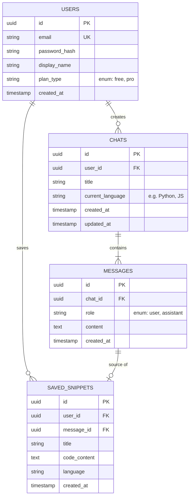

# Database Schema Recommendation for AI CodeGen

To transition your chatbot from saving history in the browser's `localStorage` to a robust cloud database, I recommend a relational database like **PostgreSQL** or **MySQL**. 

Here is the recommended Entity-Relationship Diagram (ERD) and table structure.

## Entity-Relationship Diagram (ERD)

---

## Table Breakdowns

### 1. `users` Table
Stores user accounts for authentication and settings.
- **`id`**: Primary Key (UUID)
- **`email`**: String (Unique)
- **`password_hash`**: String (Or provider ID if using Google/GitHub OAuth)
- **`plan_type`**: Enum ('free', 'pro') - useful if you want to limit API calls later.

### 2. `chats` (or `sessions`) Table
Groups messages together. When a user looks at their sidebar, this is the list they see.
- **`id`**: Primary Key (UUID)
- **`user_id`**: Foreign Key to `users.id`
- **`title`**: String (e.g., "React Login Form" - you can have the AI auto-generate this based on the first prompt).
- **`current_language`**: String (saves the dropdown state for this chat).

### 3. `messages` Table
The actual dialogue. This is what you query and pass into the OpenAI/HF router to maintain context!
- **`id`**: Primary Key (UUID)
- **`chat_id`**: Foreign Key to `chats.id`
- **`role`**: Enum ('user', 'assistant')
- **`content`**: Text (The prompt or the generated code).
- **`created_at`**: Timestamp (To sort messages chronologically).

### 4. `saved_snippets` Table (Optional but highly recommended)
Since this is a code generator, users will want to "star" or "save" specific blocks of code to a library without having to scroll through old chats to find them.
- **`id`**: Primary Key
- **`user_id`**: Foreign Key to `users.id`
- **`message_id`**: Foreign Key to `messages.id` (Where the code came from)
- **`code_content`**: Text
- **`language`**: String

---

> [!TIP]
> **Recommended Tech Stack for this Database:**
> If you are sticking to JavaScript/Node.js, I highly recommend using **PostgreSQL** paired with **Prisma ORM**. Prisma makes it incredibly easy to interact with the database using TypeScript/JavaScript.

**Do you want to proceed with this schema? If so, we can start setting up PostgreSQL and Prisma!**
